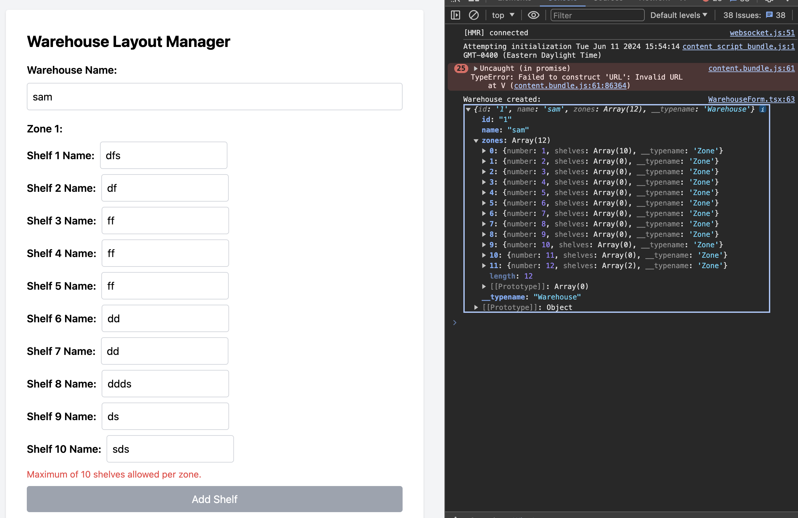

# Warehouse Layout Application



This project is a web application that allows users to define the layout of a warehouse by creating zones and adding shelves to these zones. It is built using Next.js with TypeScript.

## Getting Started

### Prerequisites

- Node.js and npm

### Installation

1. Clone the repository:

   ```bash
   git clone https://github.com/SmeeBoi/warehouse-layout.git
   cd warehouse-layout
   ```

2. Install the dependencies:
   ```bash
   npm install
   ```

### Running the Development Server

To start the development server, run:

```bash
npm run dev
```

Running Tests
To run the tests, use:

```bash
npm run test
```

Linting and Formatting
To lint the code, use:

````bash
Copy code
npm run lint
To format the code with Prettier, use:

```bash
npm run format
````

## Tools Used

- **Next.js**: React framework for server-side rendering and static site generation.
- **TypeScript**: Typed superset of JavaScript that compiles to plain JavaScript.
- **Apollo Server**: GraphQL server implementation for Node.js.
- **GraphQL**: Query language for APIs and a runtime for executing those queries.
- **Tailwind CSS**: Utility-first CSS framework for rapid UI development.
- **Jest**: JavaScript testing framework.
- **ESLint**: Pluggable linting utility for JavaScript and TypeScript.
- **Prettier**: Code formatter to ensure consistent style.
- **Husky**: Git hooks to lint and test code before commits.
- **PostCSS**: Tool for transforming CSS with JavaScript plugins.

```

```
